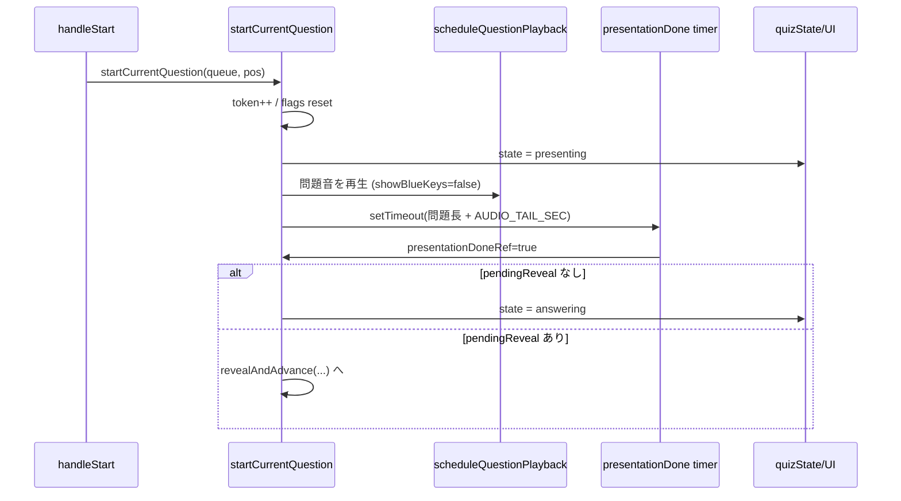
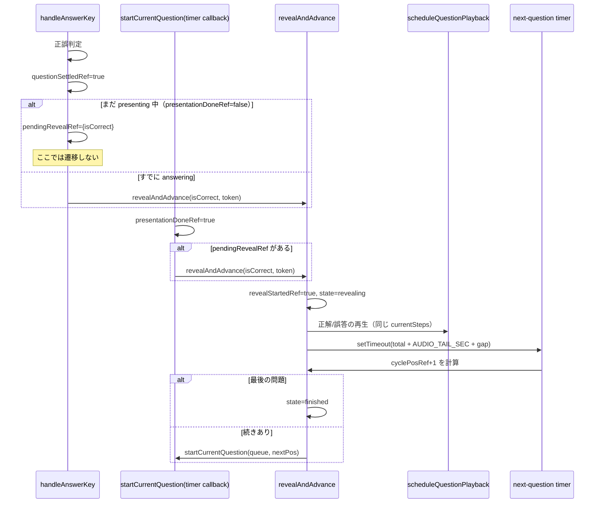

# Quiz Flow Trace（現行実装）

対象: `src/App.tsx` の `startCurrentQuestion` / `handleAnswerKey` / `revealAndAdvance` / `scheduleQuestionPlayback`

このメモは「今どう動いているか」を固定化して、停止や二重進行の原因候補を切り分けるためのもの。

## 1) 回答なし（通常）フロー

## 2) 出題中に回答あり（早押し）フロー

## 3) いま見えている「怪しい点」

- `scheduleQuestionPlayback` が毎回 `clearTimers()` を実行する  
  - この関数は「出題再生」と「正解/誤答リプレイ」の両方から呼ばれる。  
  - どちらかの呼び出しが重なったとき、**別フェーズで必要な timer まで消す可能性**がある。

- 出題完了判定が「実再生終了イベント」ではなく `setTimeout(理論時間)` 依存  
  - `attackRelease` の実行タイミングずれやブラウザ負荷で、  
    `presentationDoneRef` が実音とズレると `pendingReveal` 処理順が不安定になり得る。

- `revealAndAdvance` が `currentSteps.length === 0` の場合に次遷移を組まない  
  - そのケースが実際に作れるなら、`state=revealing` のまま止まる。

- 正答/誤答後に「別メロディ」が鳴っているなら、  
  - **同問題リプレイの誤認**よりも、`startCurrentQuestion` が追加で起動されている（=次問題の開始が走っている）可能性が高い。ログで `token` と `pos` を照合する。

## 4) 追加で見るべき観測点（次デバッグ用）

- トークン付きでログを出す  
  - `token`, `phase(presenting/answering/revealing)`, `presentationDoneRef`, `questionSettledRef`, `revealStartedRef`, `pendingRevealRef`
- `clearTimers()` 実行元を識別する  
  - `scheduleQuestionPlayback('present')` / `scheduleQuestionPlayback('reveal')` のように呼び元タグを付ける
- `startCurrentQuestion` 呼び出し起点を識別する  
  - `from: handleStart | revealAndAdvance` を出力し、「1問で2回 start されたか」を判別する
